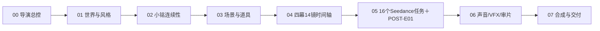
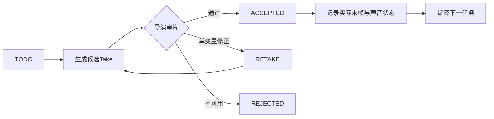

# PV01｜RunningHub导演无限画布设计

## 一、目标

把当前空白RunningHub无限画布建设为《零点回声酒馆》PV01的**导演生产作战墙**，同时承担五项职责：

1. 保存宣传片当前唯一正史与版本裁决。
2. 让人物、场景、道具、声音和VFX按唯一职责被镜头调用。
3. 让14镜、16个Seedance生成任务、1个后期片尾任务和C01—C08序列关系可视化。
4. 分离正史参考、生成任务、候选Take、接受Take与废弃素材。
5. 为后续视频生成、审片、连续性回填、合成和交付保留固定入口。

画布不是素材仓库或展示画廊。每个节点必须回答：**它控制什么、服务哪一镜、不得传递什么、当前是否允许进入生成。**

## 二、当前条件与边界

- 目标画布名称：`零号回声酒馆`。
- 当前状态：空白画布，无既有节点需要迁移或保护。
- 可用节点：文字、图片、视频、3D世界、剧本、音频、分镜格子、视频合成、AI应用、上传和作品导入。
- 本轮只上传、排版、建链和管理信息；**不启动AI生成、不运行付费工作流、不消耗RH币**。
- 原始真人身份照片不上传。人物身份使用当前正式v04角色卡、表情卡和已锁定A/B/C表演板。
- 生成画面保持textless；片名、字幕、AIGC标识与发布信息仍由后期完成。

## 三、采用架构

采用用户已确认的方案A：**横向导演流水线＋纵向资产分层**。

画布从左向右代表生产进度，从上向下代表职责层级：



选择该架构的原因：

- 导演可沿时间轴阅读故事，不必在资产堆中寻找镜头。
- 每条参考线从正史资产出发，避免同一人物或场景被重复上传后发生版本漂移。
- 生成任务放在对应镜头下方，方便逐镜生成、回填末帧和标记返修。
- 被拒绝或禁用的素材进入独立隔离区，不会误接到下一镜。

## 四、画布空间分区

使用网格吸附。以`00导演总控`为视觉原点，横向依次展开；各区之间保留约一个完整节点宽度的空白，避免连线穿过内容。

| 区域 | 主要内容 | 排列方式 | 导演用途 |
| --- | --- | --- | --- |
| 00 导演总控 | 封面、命题、60秒正片＋4秒片尾结构、技术合同、版本、图例 | 单列纵排 | 一眼判断当前正史与进度 |
| 01 世界与风格 | WK01—WK05、风格说明、色光边界 | 5张图横排＋说明卡 | 建立世界，不直接替代镜头空间 |
| 02 小铭连续性 | 正式v04四卡、F01—F04、A/B/C六板 | 日常／疯癫／蔑视三行 | 锁定同一身份与三种表演状态 |
| 03 场景与道具 | KF01—KF04、KF06、KF08、PROP01—07 | 场景在上、道具在下 | 为镜头提供空间与物件正史 |
| 04 四幕14镜 | S01—S14、C01—C08、四张分镜板 | 四幕分行，镜头按时码向右 | 主阅读区和实际拍摄顺序 |
| 05 生成任务 | S01—S14共16个Seedance任务＋POST-E01后期任务 | 每个任务位于对应镜头正下方 | 复制提示词、上传参考、生成与回填 |
| 06 声音/VFX/审片 | 13对白、环境、4类SFX、三声线、VFX规则、Take状态 | 声音横排，审片纵排 | 口型、声线、闪切与连续性审核 |
| 07 合成与交付 | 导演预演、海报帧、视频合成节点、导出合同 | 单列 | 防止把预演误认为最终动画 |
| 99 禁用与废弃 | KF05、KF07登记卡、失败Take与替代记录 | 画布最下方独立红区 | 可追溯但不得进入当前生成链 |

## 五、视觉编码

画布使用状态优先于装饰。颜色和前缀保持固定：

| 类别 | 色彩／前缀 | 含义 |
| --- | --- | --- |
| 正史资产 | 青玉色／`[CANON]` | 当前允许调用的唯一来源 |
| 日常小铭 | 琥珀色／`[A-DAILY]` | 温和、可信、陪伴 |
| 疯癫小丑 | 暗朱砂／`[B-FERAL]` | F01—F03戏谑、毒舌、狞相 |
| 蔑视小丑 | 旧金色／`[C-CONTEMPT]` | F04低、慢、干、绝对静止 |
| 待生成 | 冷灰／`[TODO]` | 尚无动态成片 |
| 待审 | 橙色／`[REVIEW]` | 已生成但未进入正史 |
| 已接受 | 绿色／`[ACCEPTED]` | 可成为下一镜连续性来源 |
| 返修 | 黄色／`[RETAKE]` | 保留问题说明，不可接续 |
| 废弃／禁用 | 红色／`[REJECTED]` | 不得接入任何当前任务 |
| 预演非终片 | 紫色／`[ANIMATIC ONLY]` | 只验证节奏、声音和合成逻辑 |

只画三类连线：

1. 正史参考 → 镜头／生成任务。
2. 生成任务 → 候选Take → 接受Take。
3. 接受Take末帧 → 下一条可接续任务。

不得用装饰性连线，也不得从`REJECTED`或`ANIMATIC ONLY`连向下一镜。

## 六、当前唯一正史裁决

### 人物

所有人物调用以角色根目录正式v04为准，不读取`候选版本/`或`历史版本/`：

1. `人物资产/小铭/小铭-人物资产总卡-v04.png`
2. `人物资产/小铭/小铭-赛博小丑妆造资产卡-v04.png`
3. `人物资产/小铭/小铭-日常赛博酒保-面部表情资产卡-v04.png`
4. `人物资产/小铭/小铭-赛博小丑-面部表情资产卡-v04.png`
5. `人物资产/小铭/小铭-PV01小丑四态表演补充卡-v01.png`

六张A/B/C表演板继续承担实际镜位与硬切匹配，不被通用24格表情卡替代。

### 场景与道具

- PV01当前调用18张：WK01—WK05、KF01—KF04、KF06、KF08、PROP01—PROP07。
- KF02是所有室内镜头唯一空间几何母图。
- KF06只控制同机位、背景短暂失焦与灯闪桥接，禁止连续融脸。
- KF08只控制片尾构图、圆钟／空椅关系和片名安全区，表情服从F04。
- KF05、KF07不上传为可选生成参考，只建立文字禁用卡；它们属于正片镜中自我对话母题。

### 版本漂移修正

旧执行包内部分链接仍指向`候选版本/小铭-*-v04.png`，但这些文件名已不再是当前入口。画布统一改用人物关联包声明的**根目录正式v04**，并在导演总控标注：

`visual_asset_version = v04`

`character_continuity_id = XIAOMING-S1-ZERO-BARTENDER`

`visual_style_id = ZERO-ECHO-VIS-NEO-CHINESE-CYBER-GLAZE-02`

## 七、上传清单

### 媒体资产：53项

| 资产组 | 数量 | 处理 |
| --- | ---: | --- |
| 世界／场景／道具正史图 | 18 | 上传到01与03区 |
| 小铭正式角色与表演总览 | 5 | 上传到02区 |
| A/B/C同机位表演板 | 6 | 上传到02区并连到S06—S14 |
| 四幕彩色分镜板 | 4 | 上传到04区幕标题下 |
| 对白音频 | 13 | 上传到06区，标注“临时声线，正式本人录音待替换” |
| 环境声 | 1 | 上传到06区，不作为跨片段原生配乐保证 |
| 同步SFX | 4 | 门铃、记忆杯、切换脉冲、杯沿回声 |
| 导演分镜预演 | 1 | 上传到07区，强制标记`ANIMATIC ONLY` |
| 片尾海报帧 | 1 | 上传到07区，作为构图参考 |

### 结构数据

- 1张导演总控卡。
- 1张64秒锁片结构节点（60秒正片＋4秒片尾）。
- 1张C01—C08序列地图。
- 14张逐镜合同卡。
- 16张Seedance生成任务卡＋1张POST-E01后期片尾卡。
- 3张声线合同卡。
- 1张VFX／灯闪／失焦安全规则卡。
- 1张连续性与审片闸门卡。
- 1张发布与技术交付卡。

## 八、14镜卡片合同

每张镜头卡固定包含：

```text
shot_id / clip_id / 时码 / 时长
叙事任务 / felt_intent / 价值变化
开始状态 / 可见动作 / 完成终点
景别 / 焦段 / 机高 / 唯一主运镜
人物表演状态 / 台词 / 声线
主光方向 / 色温 / VFX
参考资产 / 唯一职责 / 不得继承
连续性锁 / 风险 / 审片状态
对应generation_job
```

四幕分行：

| 幕 | 时码 | 镜头 | 弧线 |
| --- | --- | --- | --- |
| A 零点入口 | 00:00—00:18 | S01—S04 | open |
| B 安全表面被撕开 | 00:18—00:36 | S05—S08 | rising |
| C 疯癫毒舌峰值 | 00:36—00:50 | S09—S11 | turn／climax |
| D 突然静止的蔑视 | 00:50—01:00 | S12—S14 | release with threat |

S04在生成层拆为S04A／B／C，S11拆为S11A／B，S13与S14合并为一条连续7秒源片，因此总计16个生成任务；时间轴仍保持14个故事镜头。60—64秒片尾艺术字为后期任务，不占Seedance数量。

## 九、参考职责与传递规则

每项上传参考只承担一个主要角色，并在相邻文字卡写明“传递／忽略”：

```text
[资产] 只控制 [身份／环境／妆面／姿态／道具／声音／桥帧]；
忽略该参考中的 [人物／环境／机位／动作／音色／文字]。
```

优先级：

`人物身份 > 当前表演态 > KF02空间 > 当前镜头道具 > 桥帧／VFX > 平台默认风格`

当平台单次参考数量不足时，只在当前任务附近保留最高优先级参考；不得把整条资产库一次性接入同一生成节点。

## 十、生成与审片状态机



硬规则：

- 只有`ACCEPTED`成片或其末帧可以成为下一任务参考。
- 计划终点不等于实际终点；画布回填实际结束姿态、镜头相位、灯光、声线与背景清晰度。
- 同一镜三次失败后拆镜或转后期，不继续堆叠提示词。
- 一条生成任务只保留一个说话者；A/B/C切换全部后期硬切。
- 场景边界从正史重新锚定；连续输出链默认不超过2层，最高3层。

## 十一、音频与后期区

### 三声线

- 日常：本人声底，中低音、近讲、每秒3.5—4字。
- 疯癫：同一声底低移1—1.5半音，快—停—快，8%—12%耳语层，只允许一次短“哈”。
- 蔑视：同一声底低移约2半音，低、慢、干，耳语低于3%，主声中央。

现有13条对白是导演预演临时声线，必须挂黄色`正式本人录音待替换`标签，不能标为最终发布音轨。

### VFX

- S06→S07与S07→S08只使用短暗场／单次暖闪；S10→S11是全片唯一23帧人格夺权：明4f／暗3f／明3f／暗3f／红3f／近黑2f／完整小丑5f，背景最多12px失焦。
- S12→S13无闪硬切，异常来自小丑突然绝对静止。
- 模糊只作用于酒柜、吧台纵深和雨窗；脸、妆纹、眼睛和嘴部始终清楚。
- 禁止高频频闪、连续融脸、镜中变身、半脸拼接、双人叠影和故障线穿过五官。

## 十二、交付区

导演分镜预演必须标记：

> 仅验证64秒时码、构图、台词、声线、23帧人格夺权与片尾艺术字；画面主要由静态分镜构成，不是Seedance动态镜头，不得作为最终动画交付。

最终主版合同：

- 60秒正片＋4秒片尾，16:9，3840×2160，24fps。
- 14镜连续覆盖00:00—01:00。
- 文件名：`ZERO-ECHO-PV01-世界观先导宣传片-60s-4K-v02.mp4`。
- 主版通过后再制作30秒、15秒与9:16派生版。

## 十三、执行顺序

1. 建立00—07与99区标题、状态图例和导演总控。
2. 上传世界、人物、场景、道具与分镜母资产；完成版本和禁用检查。
3. 建立C01—C08和S01—S14时间轴。
4. 建立16个生成任务节点与1个POST-E01后期节点，写入当前中文提示词和参考职责。
5. 上传对白、环境和SFX，连接到对应镜头，不启动生成。
6. 上传导演预演和海报帧，标明非最终动画。
7. 检查节点数量、镜头时码、资产版本、连接方向、禁用区和隐私边界。
8. 保留RunningHub画布为用户可直接继续生成的交付页面。

## 十四、完成标准

- 53项媒体资产全部存在且可打开。
- 14张镜头卡与16个生成任务卡映射无遗漏；POST-E01单独标记为后期任务。
- C01—C08、S01—S14与00:00—01:00时码连续；片尾00:60—01:04独立衔接。
- 正式人物资产全部来自根目录v04；候选版、历史版和原始身份照为0。
- KF05、KF07无图片生成连线；所有`REJECTED`节点无下游连接。
- 每条任务均有参考职责、不得继承项、开始状态、终点和验收风险。
- 导演预演明确标记为静态预演，不再被误解为最终动态成片。
- 未运行任何收费生成任务，RH币余额不因本轮信息管理发生变化。

## 关联

- [[个人创作/ai铭仔/宣传片/PV01-世界观先导片/PV01-零点回声酒馆-成片制作前置总包]]
- [[个人创作/ai铭仔/宣传片/PV01-世界观先导片/PV01-零点回声酒馆-世界观先导宣传片-导演方案]]
- [[个人创作/ai铭仔/宣传片/PV01-世界观先导片/PV01-零点回声酒馆-世界观先导宣传片-逐镜执行表]]
- [[个人创作/ai铭仔/宣传片/PV01-世界观先导片/PV01-Seedance2.0-分镜生成执行包]]
- [[个人创作/ai铭仔/人物资产/小铭/小铭 - 人物模型关联包]]
- [[个人创作/ai铭仔/宣传片/PV01-世界观先导片/制作资产/01-场景与道具关键帧/README]]
- [[个人创作/ai铭仔/宣传片/PV01-世界观先导片/制作资产/02-人物A-B-C表演板/README]]
