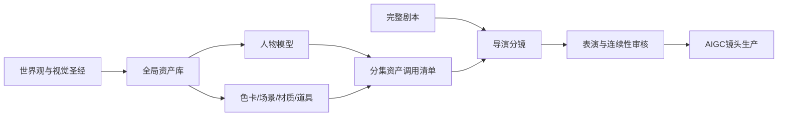

# 零点回声酒馆 - 影视资产管理与分镜生产系统设计

## 一、目标与现状判断

本设计把《零点回声酒馆》从“可阅读剧本”升级为“可直接进入AIGC影视生产的资产化项目”。每个镜头都能追溯到人物模型、表演状态、场景、色卡、材质和道具；每类资产只有一个正式来源，各集通过编号调用，不复制公共设定。

现有EP01具备完整情绪命题、九段节拍、主要对白、七处镜头描述和角色级表演重点，但按新标准仍不是完整生产稿：没有正式镜号、逐镜头面部肌肉和肢体状态、场景色卡编号、道具编号及状态转换、场景与材质调用表。因此后续采用“主剧本＋导演分镜＋表演连续性＋分集资产清单”的组合，而不是继续把所有内容塞进一份Markdown。

## 二、架构方案与决定

曾比较三种方式：

| 方案 | 优点 | 风险 | 结论 |
| --- | --- | --- | --- |
| 全局资产单一来源＋分集调用清单 | 可复用、可追踪、适合长篇和版本管理 | 前期需要建立模板和编号 | 采用 |
| 每集自包含全部资产副本 | 单集打开即读 | 颜色、服装和道具极易漂移 | 不采用 |
| 所有内容写进一份巨型导演稿 | 搜索直观 | 文档失控，任何修改都牵动全篇 | 不采用 |

最终原则：**设定只保存一次，分集只记录使用什么、在何时变成什么状态。**



## 三、正式目录

```text
个人创作/ai铭仔/
├── README.md
├── 资产库/
│   ├── README.md
│   ├── 色彩资产/
│   │   ├── README.md
│   │   ├── 零点回声酒馆 - 全局色卡池.md
│   │   ├── 色卡资产管理模板.md
│   │   ├── 场景色卡/
│   │   └── 色卡预览图/
│   ├── 场景资产/
│   │   ├── README.md
│   │   ├── 场景资产管理模板.md
│   │   ├── 零点回声酒馆/
│   │   └── EP01专属场景/
│   ├── 道具资产/
│   │   ├── README.md
│   │   ├── 道具资产管理模板.md
│   │   ├── 核心道具/
│   │   └── EP01专属道具/
│   └── 材质资产/
│       ├── README.md
│       ├── 材质资产管理模板.md
│       └── 核心材质/
├── 人物资产/
│   ├── README.md
│   ├── 小铭/
│   ├── 林野/
│   └── 姜禾/
├── 世界观与视觉/
│   ├── README.md
│   └── 零点回声酒馆 - 世界观与环境视觉圣经.md
└── 剧集/第一季/
    ├── README.md
    └── EP01-未写完的未来/
        ├── README.md
        ├── EP01-未写完的未来-完整剧本.md
        ├── EP01-未写完的未来-电影级导演分镜.md
        ├── EP01-未写完的未来-表演情绪与肢体连续性.md
        ├── EP01-未写完的未来-场景色卡调用表.md
        └── EP01-未写完的未来-道具调用与连续性.md
```

`人物资产`和`世界观与视觉`继续保持独立，不搬入`资产库`：人物模型承担身份连续性，世界观圣经承担正史与美术方向；资产库只管理可被多集调用的生产对象。

## 四、编号与生命周期

### 编号规则

| 类型 | 格式 | 示例 |
| --- | --- | --- |
| 全局色卡 | `ZERO-ECHO-GLOBAL-PALETTE-NN` | `ZERO-ECHO-GLOBAL-PALETTE-01` |
| 场景色卡 | `ZERO-ECHO-EPnn-SCnn-PALETTE-NN` | `ZERO-ECHO-EP01-SC03-PALETTE-01` |
| 场景 | `ZERO-ECHO-LOC-名称-NN` | `ZERO-ECHO-LOC-ZERO-BAR-MAIN-01` |
| 道具 | `ZERO-ECHO-PROP-名称-NN` | `ZERO-ECHO-PROP-FUTURE-RING-01` |
| 材质 | `ZERO-ECHO-MAT-名称-NN` | `ZERO-ECHO-MAT-SMOKED-WALNUT-01` |
| 镜头 | `EPnn-SCnn-SHnnn` | `EP01-SC03-SH012` |
| 表演状态 | `EPnn-角色-SCnn-PERF-NN` | `EP01-LINYE-SC03-PERF-02` |

编号一经进入正式分镜不得复用或重新解释。镜头删除后保留编号和废弃记录，不让后续镜头顶替旧编号。

### 状态

所有资产统一使用：`草案 → 待审 → 锁定 → 废弃`。

- 草案：字段可修改，不允许进入正式分镜。
- 待审：结构完整，可用于测试画面，不可批量生产。
- 锁定：人工确认，可被分集调用。
- 废弃：保留历史与替代版本，不再进入新镜头。

## 五、剧本与导演分镜职责

### 完整剧本

只负责故事正史、场景顺序、对白、行为因果、情绪转折、旁白、时长区间和结尾语录。它可以描述关键画面，但不重复记录每个镜头的焦段、全部灯位和色卡数值。

### 电影级导演分镜

每个镜头必须包含以下字段：

| 模块 | 必填内容 |
| --- | --- |
| 基础 | `shot_id`、场次、时码、时长、叙事目的、情绪价值变化 |
| 画面 | 景别、构图、前中后景、机位高度、水平角度、俯仰角、焦段、景深 |
| 运镜 | 起点、主运动、速度、停止点；一镜只设一个主运动 |
| 场景 | `location_id`、时间、天气、空间区域、可见材质、背景活动 |
| 人物 | 角色编号、入画位置、走位、视线、距离、遮挡关系 |
| 表演 | 入镜情绪、潜台词、面部微表情、肢体、动作触发、出镜情绪 |
| 色光 | `scene_palette_id`、角色色卡、颜色比例、主辅轮廓光、色温、光比、IRE、曝光 |
| 道具 | `prop_id`、版本、状态、摆位、持握手、交互动作、镜头前后变化 |
| 声音 | 台词、呼吸、拟音、环境声、音乐进入点与静默 |
| 特效 | 记忆投影、界面、粒子、镜面延迟、交互光和物理边界 |
| 生产 | 静帧提示词、视频提示词、负面约束、身份参考、审核风险 |
| 连续性 | 承接镜头、下一镜状态、不可变化项、审核结论 |

## 六、表演情绪与肢体连续性

表演不使用“悲伤地看着”“十分震惊”等抽象词结束描述。每个角色每个镜头都必须记录可见的肌肉、呼吸和重心变化。

### 面部表情字段

- 双眉：高度、内收、外展、左右不对称。
- 上下眼睑：张力、眨眼频率、视线停留和回避方向。
- 虹膜与瞳孔：只记录真实反应或正史能力，不擅自发光。
- 鼻翼：呼吸和情绪张力。
- 嘴角与唇：压紧、微张、唇峰张力、吞咽和停顿。
- 下颌：放松、收紧、咬肌与抬头幅度。
- 皮肤与泪膜：潮红、苍白、泪膜、泪痕和妆面变化。

### 肢体语言字段

- 脊柱、肩膀、胸腔和呼吸节奏。
- 重心落点、脚尖方向、站坐转换和步幅。
- 双手职责、手指压力、持物受力和无意识小动作。
- 头部角度、身体朝向、人与人之间的距离。
- 动作速度、犹豫时长、动作是否完成或被打断。

### 状态转换

每个镜头记录：`进入状态 → 触发事件 → 可见变化 → 离开状态`。表演强度采用0—5级，只用于连续性，不代替具体描述。

## 七、全局色卡池

原`人物资产/零点回声酒馆 - 全局色卡与人物呈现基准.md`迁移为`资产库/色彩资产/零点回声酒馆 - 全局色卡池.md`，成为唯一正式来源；人物卡、世界视觉圣经和分镜全部改用双链引用，不复制整张色表。

### 四级继承

```text
全局原始色与禁用色
→ 场景色卡与光源色
→ 角色固有色卡与肤色保护
→ 单镜头临时偏移
```

单镜头临时偏移不得改变角色固有肤色、发色、瞳色、服装身份色或核心道具颜色。

### 色卡资产模板字段

| 类别 | 字段 |
| --- | --- |
| 身份 | `palette_id`、名称、项目、版本、状态、父色卡、适用范围 |
| 色值 | HEX、RGB、HSL、亮度、建议饱和度、建议占比 |
| 功能 | 世界职责、情绪职责、材质用途、光源用途、禁用位置 |
| 灯光 | 色温、光比、目标IRE、高光滚降、黑位、肤色保护 |
| 继承 | 全局色、场景覆盖、角色覆盖、镜头临时偏移 |
| 审核 | 色彩占比、污染检查、色盲可辨性、版本记录 |

场景主辅强调色比例允许因四舍五入在98%—102%之间，否则不得锁定。

## 八、场景资产

### 场景卡字段

- `location_id`、名称、世界层级、版本、状态和正史来源。
- 空间尺寸、平面关系、入口出口、角色安全走位和固定机位。
- 前景、中景、后景、墙地顶结构和可移动物件。
- 固定材质编号、磨损、湿度、反射、透光与声音特性。
- 时间、天气、基础营业光、记忆状态光和异常状态光。
- 默认场景色卡、允许偏移、禁用颜色和人物肤色保护。
- 场景连续性、破坏状态、恢复状态和版本历史。
- 建立镜头、对话镜头、特写安全区和16:9构图限制。

### EP01首批场景

1. 旧城区高架雨巷与零点入口。
2. 零点回声酒馆主吧台。
3. 被写完的未来走廊。
4. 三十年模拟体验厅。
5. 旧车站意外早餐记忆。
6. 通知式计划的影院、餐厅与回家节点。
7. 邀请式同行的老电影厅、雨檐与街角面馆。
8. 妆后语录状态的空酒馆。

## 九、道具资产

### 道具卡字段

| 模块 | 字段 |
| --- | --- |
| 身份 | `prop_id`、名称、类别、版本、状态、正史来源 |
| 物理 | 长宽高、重量感、形状、材质编号、颜色编号、表面磨损 |
| 结构 | 正侧背、底部、开合、连接点、可动部件和发光区域 |
| 剧情 | 叙事功能、首次出现、角色关系、象征意义 |
| 交互 | 默认摆位、持握手、抓握方式、受力、操作顺序和安全动作 |
| 特效 | 激活条件、光色、粒子、界面、反射、音效和禁止表现 |
| 连续性 | 场次前状态、场次后状态、不可逆变化、维修/复原规则 |
| 生产 | 英雄角度、细节图、提示词、负面约束和当前有效图片 |

### EP01首批核心道具

- 未来存储环：`已装载三十年模拟 → 投影中 → 删除确认 → 空白环`。
- “未定式”记忆杯：`空杯 → 青蓝雾酒液 → 一口触发 → 雾散开 → 留下“变化”`。
- 黑钛调酒匙：小铭固定右手道具，长度和柄端结构不变。
- 姜禾纪实相机：肩带方向、镜头长度、磨损与持握动作固定。
- 停在00:17的圆钟、黄铜门铃、空白明日日历和延迟长镜。

## 十、材质资产

材质卡记录材质如何响应光与动作，防止AIGC把一件服装或场景在不同镜头中生成成不同物质。

必填字段：`material_id`、名称、基础色、粗糙度、金属度、透射、折射、厚度、织纹/颗粒、磨损、湿态变化、主光响应、轮廓光响应、近景细节、禁止表现和适用资产。

首批材质：烟熏胡桃木、旧黄铜、拉丝黑钛、烟熏玻璃、暖灰矿物灰泥、深灰磨石、形状记忆织物、珠光防雨智能织物和电子墨水织线。

## 十一、人物模型与资产库接口

现有每个角色继续保留“人物总资产卡＋面部表情卡＋关联包”。新增以下接口：

- `narrative_age`、`visual_age`和`deage_rule`。
- `global_palette_id`、`character_palette_id`和场景覆盖边界。
- 固有服装涉及的`material_id`和核心`prop_id`。
- 表情卡格子与导演分镜`performance_state_id`的映射。
- 当前总卡、表情卡、服装版本和历史禁用版本。

场景光可以改变人物观感，但不得改变人物身份。分镜只能通过关联包调用当前有效图片，不能从文件夹随机选择旧图。

## 十二、EP01独立制作包迁移

用户已允许把EP01迁移到独立文件夹。正式迁移规则：

1. 将`剧集/第一季/EP01-未写完的未来-完整剧本.md`移动为`剧集/第一季/EP01-未写完的未来/EP01-未写完的未来-完整剧本.md`。
2. 旧位置不保留同名跳转文件，避免Obsidian出现两个同名目标；全库更新旧路径双链。
3. 新建分集README、导演分镜、表演连续性、场景色卡调用表和道具调用表。
4. `剧集/第一季/README.md`成为本季唯一分集入口。
5. EP01正式稿同步吸收已经确认的年轻化仿真人画风、双行为预演、开放邀请、客人感谢离开和小丑语录收束。

## 十三、完整性门槛

### 单镜头锁定条件

- [ ] 镜号、时码、时长和叙事目的完整。
- [ ] 场景、人物、色卡、道具和材质编号全部有效。
- [ ] 每名可见角色都有面部表情、肢体、动作触发和离镜状态。
- [ ] 场景前中后景、光源、色温、曝光和颜色比例明确。
- [ ] 道具位置、持握、状态变化与相邻镜头一致。
- [ ] 声音、特效、提示词、负面约束和审核风险完整。
- [ ] 不存在未定义颜色、无来源科技光或随机装饰。

### 分集锁定条件

- [ ] 所有镜头的时长总和等于成片目标时长。
- [ ] 情绪状态能从开场连续推演到离场，不出现无触发跳变。
- [ ] 场景色卡覆盖全部场次，颜色占比与全局规则一致。
- [ ] 道具状态机从首次出现到最终状态无断裂。
- [ ] 人物年龄、脸、服装、表情卡和关联包版本一致。
- [ ] 全部Obsidian双链有效，旧路径引用为零。

## 十四、实施顺序

1. 建立资产库目录、四类模板、README和编号规则。
2. 迁移全局色卡为唯一正式色彩源并修复引用。
3. 迁移EP01到独立制作包并更新全库双链。
4. 建立EP01场景、色卡、道具和材质首批资产。
5. 统一三名人物的年轻化年龄、未来服装和资产接口。
6. 重写EP01完整剧本，加入双行为结果预演与离场闭环。
7. 制作逐镜头16:9电影级导演分镜和表演连续性表。
8. 完成场景色卡、道具调用、时长、双链和版本验收。

## 十五、本阶段边界

- 本阶段先完成Obsidian文字资产、编号、目录、脚本和导演分镜。
- 不覆盖小铭本人参考照和现有图片；后续年轻化图片使用新版本。
- 不同步个人网站，不部署服务，不改动《月陨》等其他项目。
- 未通过文字与连续性审核前，不批量生成分镜图片或视频。

## 关联

- [[个人创作/ai铭仔/docs/superpowers/specs/2026-07-11-零点回声酒馆-年轻化仿真人视觉统一设计|年轻化仿真人视觉统一设计]]
- [[个人创作/ai铭仔/docs/superpowers/specs/2026-07-11-零点回声酒馆-设计方案|第一季总设计]]
- [[个人创作/ai铭仔/剧集/第一季/EP01-未写完的未来/EP01-未写完的未来-完整剧本|当前EP01正式稿]]
- [[个人创作/ai铭仔/人物资产/README|人物资产中心]]
- [[个人创作/ai铭仔/世界观与视觉/零点回声酒馆 - 世界观与环境视觉圣经]]
